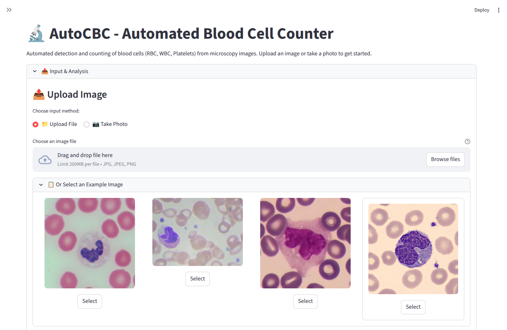
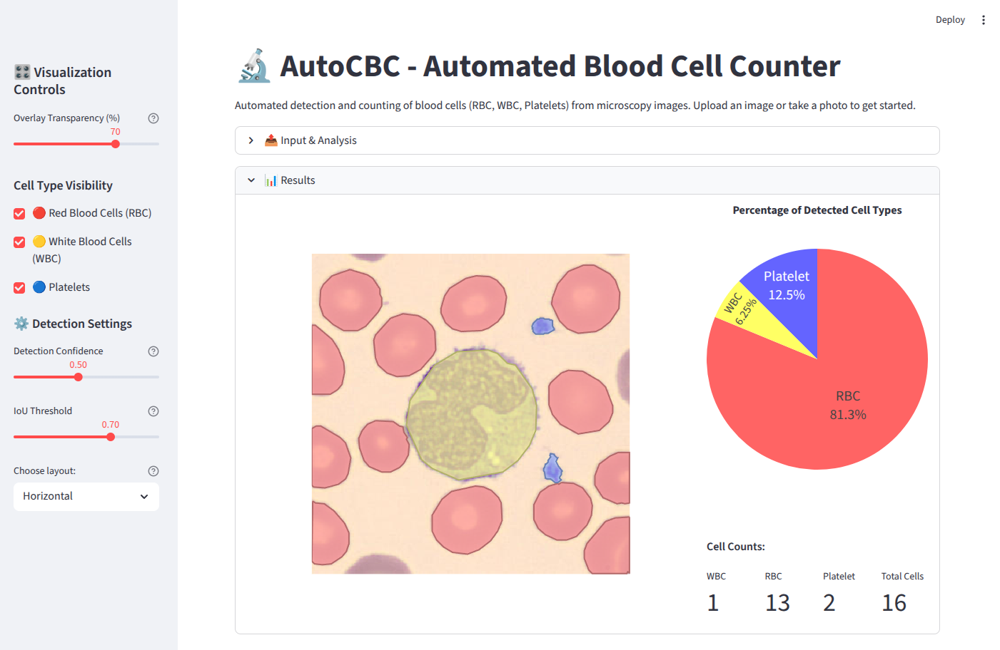

<!-- SPDX-License-Identifier: AGPL-3.0-only -->
<!-- Copyright (c) 2025 Marco Mongi -->

# AutoCBC

Automated Blood Cell Counting using AI — A web application that analyzes blood smear microscopy images to automatically detect, count, and segment red blood cells, white blood cells, and platelets using state-of-the-art computer vision models.


## Try It Now

Experience AutoCBC directly in your browser without any installation:

**[Launch AutoCBC on Streamlit Community Cloud](https://autocbc.streamlit.app/)**

Upload your own blood smear images or try the included example images to see the system in action.

> ⚠️ **DISCLAIMER**
>
> *This application is intended for educational and research purposes only. It is not a medical device and should not be used for clinical diagnosis or treatment decisions.
The cell counting results provided by this software are approximate and may vary depending on image quality, sample preparation, and other factors.
Always consult a qualified medical professional for accurate interpretation and medical advice.
The authors assume no responsibility or liability for any decisions, damages, or outcomes resulting from the use of this tool.*

## Features

- **Automated Cell Detection**: Detects and classifies red blood cells (RBCs), white blood cells (WBCs), and platelets using YOLOv11 Nano
- **Precise Segmentation**: Generates pixel-perfect cell boundaries using SAM2 (Segment Anything Model 2)
- **Interactive Visualization**: Adjustable transparency overlay with color-coded cell types (red for RBCs, yellow for WBCs, blue for platelets). Hover over results for more information.
- **Comprehensive Results**: Displays cell counts, percentage distributions, and interactive pie charts
- **Flexible Input**: Upload images from your device, capture via camera, or select from example gallery
- **Fast Processing**: Results in under 30 seconds for typical microscopy images
- **No Installation Required**: Run directly in your browser via Streamlit Community Cloud

## How It Works

AutoCBC uses a two-stage AI pipeline to analyze blood smear images:

1. **Detection Stage**: A YOLOv11 Nano model scans the image to locate and classify each cell type
2. **Segmentation Stage**: SAM2 uses the detected regions to generate precise pixel-level segmentation masks
3. **Analysis Stage**: Cell counts and statistics are calculated and visualized

### Input Selection



Choose how to provide your blood smear image:
- Upload an image file (JPG, JPEG, PNG)
- Take a photo using your device camera
- Select from a gallery of example images

### Processing Results



The application displays:
- Original image with color-coded segmentation overlays (adjustable transparency, select cells of interest, hover functionality)
- Pie chart showing the proportion of each cell type (interactive)
- Detailed cell counts for RBCs, WBCs, and platelets
- Total cell count across all detected cells

## Use Cases

AutoCBC is designed to support:

- **Resource-Limited Settings**: Provide basic CBC functionality where expensive automated analyzers are unavailable
- **Educational Applications**: Training tool for medical students and laboratory technicians
- **Pre-Screening**: Quick triage to identify samples requiring detailed analysis
- **Telemedicine**: Enable remote consultation with digitized blood smear images
- **Quality Control**: Compare automated counts with manual review to identify discrepancies

> See disclaimer above

## Installation

### Prerequisites

- Python 3.12.3
- NVIDIA GPU with CUDA support (optional, but recommended for faster processing)

### Steps

1. **Clone the Repository**

   ```bash
   git clone https://github.com/marcoom/auto-cbc.git
   cd auto-cbc
   ```

2. **Create a Virtual Environment**

   ```bash
   python3 -m venv .venv
   source .venv/bin/activate
   ```

3. **Install Dependencies**

   ```bash
   pip install -r requirements.txt
   ```

4. **Run the Application**

   ```bash
   streamlit run app.py
   ```

5. **Open Your Browser**

   Navigate to `http://localhost:8501`

## Docker

### Using Pre-built Image from Docker Hub

The easiest way to run AutoCBC is using the pre-built Docker image:

```bash
docker pull marcoom/auto-cbc:latest
docker run -p 8501:8501 marcoom/auto-cbc:latest
```

Then open your browser and navigate to `http://localhost:8501`

### Building the Image Locally

To build the Docker image from source:

```bash
docker build -t auto-cbc .
```

### Running the Container

After building locally, run the container:

```bash
docker run -p 8501:8501 auto-cbc
```

The application will be available at `http://localhost:8501`

## Project Structure

```
auto-cbc/
├── app.py                              # Main Streamlit application entry point
├── config.py                           # Configuration constants and model parameters
├── Dockerfile                          # Docker container configuration for deployment
├── docs/                               # Project documentation
│   ├── PRD.md                          # Product Requirements Document
│   └── clinical-context.md             # Clinical background and use cases
├── LICENSE                             # AGPL-3.0 license file
├── media/                              # Images and demo files for documentation
│   └── test_images/                    # Example blood smear images for testing
├── models/                             # Pre-trained AI models
│   ├── cbc_detection.pt                # YOLOv11 Nano detection model (5.3MB)
│   └── sam2.1_t.pt                     # SAM2 tiny segmentation model
├── notebooks/                          # Jupyter notebooks for experimentation
├── NOTICE                              # Copyright and attribution notices
├── README.md                           # This file
├── .dockerignore                       # Files to exclude from Docker builds
├── .gitignore                          # Files to exclude from version control
├── requirements.txt                    # Python package dependencies
├── THIRD_PARTY_LICENSES/               # Third-party software licenses
│   ├── LICENSE_cctorch.txt             # BSD-3-Clause license for cctorch
│   └── LICENSE_SAM2.txt                # Apache-2.0 license for SAM2
└── utils/                              # Core utility modules
    ├── detection.py                    # YOLO-based cell detection logic
    ├── metrics.py                      # Cell counting and statistics calculation
    ├── segmentation.py                 # SAM2-based instance segmentation
    └── visualization.py                # Image overlay and result visualization
```

## Technical Details

### Models

- **Detection Model**: YOLOv11 Nano trained on blood cell microscopy images
  - Model file: `models/cbc_detection.pt`
  - Training repository: [yolo-auto-cbc-training](https://github.com/marcoom/yolo-auto-cbc-training)

- **Segmentation Model**: SAM2 Tiny (Segment Anything Model 2)
  - Model file: `models/sam2.1_t.pt` (automatically downloaded)
  - Provides pixel-perfect segmentation masks from bounding box prompts

### Core Dependencies

- **streamlit**: Web application framework
- **ultralytics**: YOLOv11 (object detection) and SAM2 (instance segmentation) implementation
- **opencv-python, numpy, pillow**: Image processing
- **matplotlib, plotly**: Visualization and charts

## License

AutoCBC is released under **AGPL-3.0**. See the [`LICENSE`](./LICENSE) file.

It includes/uses third-party software:

- **Ultralytics YOLO** (AGPL-3.0) — unmodified
- **SAM2** (Apache-2.0) — see `THIRD_PARTY_LICENSES/LICENSE_SAM2.txt`
- **cctorch** (BSD-3-Clause) — see `THIRD_PARTY_LICENSES/LICENSE_cctorch.txt`

If you use the online Streamlit service, the corresponding source code is available in this repository in accordance with AGPL-3.0.

Source available at https://github.com/marcoom/auto-cbc